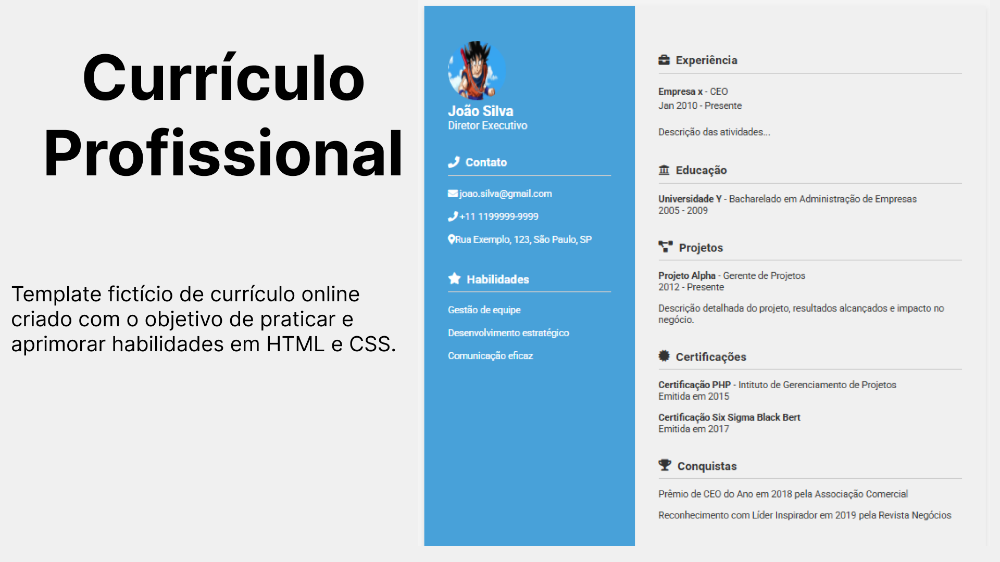

# 📄 Projeto: Currículo Profissional (HTML + CSS)  

Este projeto foi desenvolvido como parte do curso **“JavaScript do Básico ao Avançado + 132 Projetos Reais”** do **Clevison Santos** 🎓.  
O objetivo foi **praticar HTML e CSS na criação de um layout de currículo moderno e responsivo**, aplicando conceitos de estruturação, estilização e organização de conteúdo.  

A ideia principal foi montar um **modelo fictício de currículo** 📑, com seções de perfil, experiência, formação, projetos e conquistas, explorando recursos visuais como **flexbox**, **ícones do Font Awesome** e **Google Fonts**.  

## 🛠️ Tecnologias utilizadas
- 🖋️ **HTML5** para a estrutura da página  
- 🎨 **CSS3** para a estilização e responsividade  
- 🔗 **Font Awesome** para ícones  
- ✍️ **Google Fonts** para tipografia  

## 📚 Aprendizados
- 📐 Criação de layouts responsivos com **flexbox**  
- 🧩 Estruturação semântica do conteúdo em HTML  
- 🎨 Estilização e hierarquia visual com CSS  
- 🗂️ Organização de seções de forma clara e intuitiva  

👉 O projeto é **totalmente fictício**, criado apenas para fins de **aprendizado e portfólio**. 🚀  

---

🔗 **Acesse o Projeto Online:**  
🌐 [GitHub Pages](https://thamiressarges.github.io/curriculum-profissional)  
